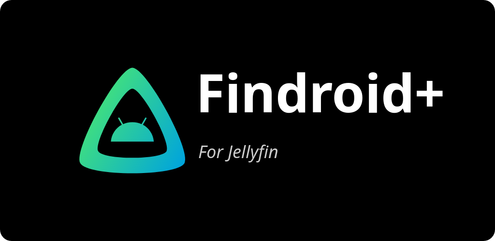

# Findroid+

Findroid+ is [pschmitt](https://github.com/pschmitt)'s fork of
[Findroid](https://github.com/jarnedemeulemeester/findroid), a third-party native Android/Android
TV client for Jellyfin — with added features such as Sonarr/Radarr integration.

**This project is in its early stages so expect bugs.**

## Installation

Findroid+ isn't published on Google Play, Amazon Appstore, F-Droid, or IzzyOnDroid — those
listings are for the upstream Findroid project, under a different package name, and installing
from them will **not** give you this fork.

Instead, install and auto-update Findroid+ via [Obtainium](https://obtainium.imranr.dev/)
pointed at this repository, or grab an APK directly from the
[Releases page](https://github.com/pschmitt/findroidplus/releases).

## Features
- Native interface for phone and Android TV, browsing movies, series, seasons, and
  episodes (direct play only, no transcoding)
- Offline downloads for playback on the road
- Playback via ExoPlayer or mpv, with broad codec support (H.264/H.265/H.266, VP8/VP9/AV1,
  DTS/TrueHD/AC-3, styled SSA/ASS subtitles, and more) and optional software decoding fallback
- Picture-in-picture mode
- Media chapters with timeline markers and chapter navigation gestures
- Trickplay (Jellyfin 10.9+) and media segment skip/auto-skip (Jellyfin 10.10+)
- Sonarr/Radarr integration: upcoming-release calendar and download queue status

## License
This project is licensed under [GPLv3](LICENSE).

The logo is a combination of the Jellyfin logo and the Android robot.

The Android robot is reproduced or modified from work created and shared by Google and used according to terms described in the Creative Commons 3.0 Attribution License.

Android is a trademark of Google LLC.

Google Play and the Google Play logo are trademarks of Google LLC.
